# Kubernetes Templating with Kustomize: A Practical Guide

This repository is an educational teaching aid designed to take you from a basic understanding of Kubernetes manifests to complex, enterprise-grade templating using **Kustomize** (the native configuration management tool built into `kubectl`).

## Why Kustomize?
Unlike other templating engines that use string replacement (like Helm), Kustomize uses a **patch-based** approach. You define "Base" resources once and "Overlay" specific changes for different environments (Dev, QA, Prod). This prevents duplication and makes your configuration easier to audit.

---

## Prerequisites
No separate installation is required. Kustomize is built directly into `kubectl`:
```bash
kubectl version --client
```

---

## Project Structure
- **`example_n/`**: Each directory contains a self-contained Kustomize lesson.
- **`base/`**: The core, environment-agnostic YAML manifests.
- **`overlays/`**: Environment-specific customizations (patches).
- **`output.yaml`**: The final, rendered result for that example (generated by the runner script).
- **`run_examples.sh`**: A helper script to render all examples and update the `output.yaml` files.

## Architectural Flow

The following diagram illustrates how Kustomize assembles the final `output.yaml` for each example by layering configurations.

```mermaid
graph TD
    subgraph Example_0 [Basic Layering]
        B0[Base: Nginx] --> O0[Dev Overlay: Prefix + Replicas]
        O0 --> R0(Rendered Output)
    end

    subgraph Example_1 [Hardening]
        B1[Base: Web + API] --> O1[Prod Overlay: Limits + Sidecar]
        O1 --> R1(Rendered Output)
    end

    subgraph Example_2 [Modular Components]
        B2[Base: App] --> C2_1[Component: Monitoring]
        B2 --> C2_2[Component: DB Proxy]
        C2_1 --> O2[Prod Overlay: Mixins]
        C2_2 --> O2
        O2 --> R2(Rendered Output)
    end

    subgraph Example_3 [Dynamic Fleet]
        B3[Base: Auth + Billing] --> O3[Prod Overlay: Replacements]
        O3 --> R3(Rendered Output)
        R3 -- "Inject Auth Name" --> R3
    end

    subgraph Example_4 [Traceability]
        B4[Base: Secured App] --> C4[Component: Security Tagging]
        C4 --> O4[Prod Overlay: Build Metadata]
        O4 --> R4(Rendered Output)
    end

    subgraph Example_5 [Deep Traceability]
        B5[Corp Base] --> D5[Division Overlay]
        D5 --> A5[App Base]
        A5 --> O5_Final[Prod Overlay]
        C5[Component: OTEL] --> O5_Final
        O5_Final --> R5(Rendered Output with Stack Traces)
    end

    style R0 fill:#f9f,stroke:#333,stroke-width:2px
    style R1 fill:#f9f,stroke:#333,stroke-width:2px
    style R2 fill:#f9f,stroke:#333,stroke-width:2px
    style R3 fill:#f9f,stroke:#333,stroke-width:2px
    style R4 fill:#f9f,stroke:#333,stroke-width:2px
    style R5 fill:#f9f,stroke:#333,stroke-width:2px
```



---

## The Lessons

### [Example 0: The Base/Overlay Pattern](./example_0)
**Goal:** Master the fundamental "Layering" concept.
- **Concepts:** `resources`, `namePrefix`, `labels`, `configMapGenerator`.
- **Educational Value:** Learn how to create a single Deployment and Service base and then use an overlay to rename them for "dev" and scale up the replicas without touching the original base files.
- **Key Feature:** `configMapGenerator` automatically appends a hash to the ConfigMap name, ensuring that any configuration change triggers an automatic rollout of your pods.

### [Example 1: Production Hardening](./example_1)
**Goal:** Moving from simple replicas to production-ready deployments.
- **Concepts:** `secretGenerator`, Strategic Merge Patches, Multi-resource bases.
- **Educational Value:** Shows how to manage two tiers (Web + API) together. The `prod` overlay demonstrates "hardening"—injecting resource limits (CPU/Memory) and a log-exporter sidecar container only for the production environment.
- **Key Feature:** Strategic Merge Patching allows you to add or modify specific fields deep within a YAML structure without rewriting the entire resource.

### [Example 2: Modular Components](./example_2)
**Goal:** The "Lego" approach to Kubernetes architecture.
- **Concepts:** `kind: Component`, `components`.
- **Educational Value:** Instead of copy-pasting monitoring or database proxy settings into every app, you package them into reusable "Components."
- **Key Feature:** Components are "mixins." You can "plug in" a monitoring component to any deployment just by adding a reference to it in your kustomization. This is the gold standard for managing cross-cutting concerns in large organizations.

### [Example 3: Enterprise Fleet & Dynamic Wiring](./example_3)
**Goal:** Managing complex dependencies between microservices.
- **Concepts:** `replacements`, multi-file Generators, Secret injection.
- **Educational Value:** Models a "Fleet" (Auth and Billing services). It solves the "Dynamic URL" problem: how does the Billing service know the URL of the Auth service when the Auth service's name changes in every environment (e.g., `dev-auth-service` vs. `prod-auth-service`)?
- **Key Feature:** `replacements` act as the "brain." They copy the rendered name of the Auth service and inject it directly into the environment variables of the Billing service at build time.

### [Example 4: Traceability & Leon's Problem](./example_4)
**Goal:** Solve the "Where did this YAML come from?" problem in complex setups.
- **Concepts:** `buildMetadata`, `labels` (for tagging), `securityContext`.
- **Educational Value:** Shows two ways to audit your configuration. It uses labels to "fingerprint" which component modified a resource and `buildMetadata` to inject the original file path as an annotation.
- **Key Feature:** The final YAML contains `config.kubernetes.io/origin` annotations and `modified-by` labels, providing a 100% transparent audit trail of the templating process.

### [Example 5: Extreme Traceability & The Matryoshka Pattern](./example_5)
**Goal:** Debugging deep inheritance chains in enterprise environments.
- **Concepts:** Deep inheritance, `transformerAnnotations`.
- **Educational Value:** Models a 5-layer inheritance chain (Corp Base -> Division -> App -> Component -> Prod). In such a "Matryoshka doll" setup, it becomes impossible to know which layer changed what.
- **Key Feature:** By enabling `transformerAnnotations`, the final YAML contains a literal "stack trace." Kustomize injects annotations showing exactly which internal transformer (e.g., `LabelTransformer`, `PrefixTransformer`) modified the resource and *exactly which file* in the 5-layer chain triggered that modification.

---

## Running the Examples

To render all examples and see the results in your terminal:
```bash
./run_examples.sh
```

To render a specific overlay manually:
```bash
kubectl kustomize example_1/overlays/prod
```

To apply an example to a live cluster:
```bash
kubectl apply -k example_0/overlays/dev
```
